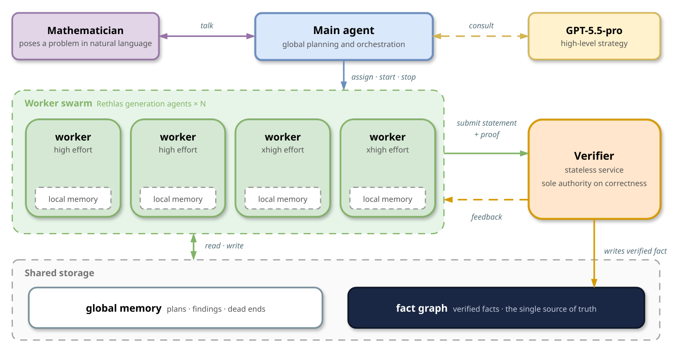
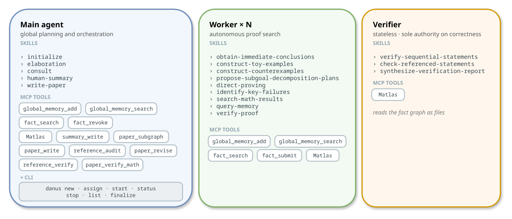
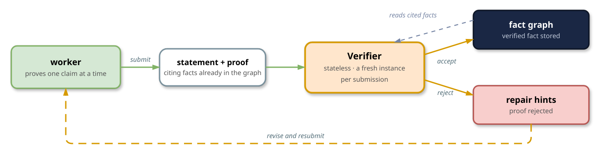
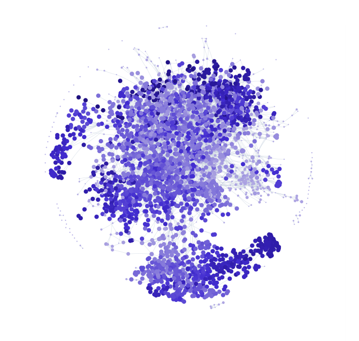

# Danus: Orchestrating Mathematical Reasoning Agents with Fact-Graph Memory

<p align="center">
  <a href="https://arxiv.org/abs/2607.06447"></a>
  <a href="https://frenzymath.com/blog/danus/"></a>
  <a href="https://github.com/frenzymath/Rethlas"></a>
  <a href="https://www.xiaohongshu.com/discovery/item/6a4da1ba00000000070201ef?source=webshare&xhsshare=pc_web&xsec_token=ABfiiMB7yyB-dW_hMzh3MW7ZRG2ddm5in_wBnBALXO6DE=&xsec_source=pc_share"></a>
  <a href="LICENSE"></a>
</p>

Danus orchestrates mathematical reasoning agents with fact-graph memory. A main
agent (Claude Code) steers a swarm of autonomous codex workers that prove; a
cold-start verifier is the sole authority on correctness: a result becomes real
only once it passes. Verified results accumulate in a content-addressed fact
graph — the system's only source of truth — and a strategy loop (a strong
reasoning model) decomposes the problem and steers the swarm. When you have the
answer, Danus renders it into a human report or a publishable LaTeX paper.

Danus builds on the worker–verifier core of our earlier system
[Rethlas](https://github.com/frenzymath/Rethlas)
([arXiv:2604.03789](https://arxiv.org/abs/2604.03789)). The
[paper](https://arxiv.org/abs/2607.06447) and the
[technical report](https://frenzymath.com/blog/danus/) tell the full story:
the system, six research-level case studies it resolved, and what we learned
along the way.

See `ARCHITECTURE.md` for the layered design and the map of every module.

## How it works

<p align="center"></p>

The design follows a strict separation of powers: the main agent performs the
global planning and coordination, the workers carry out the detailed proof
search, the verifier is the sole authority on correctness, and the fact graph
holds every verified result and is the system's only source of truth.

Each kind of agent carries out its role through its own skills and its own
role-gated set of tools, so the separation is enforced by construction, not by
prompts: the main agent has no `fact_submit` (the agent that steers the search
structurally cannot introduce unverified mathematics into the fact graph), and
the verifier writes nothing at all.

<p align="center"></p>

Every claim enters truth through one cycle:

<p align="center"></p>

A worker typically focuses on one claim at a time — a lemma, a counterexample, a
toy example — rather than an entire proof. It repeatedly submits the claim with a
supporting proof and revises it under the verifier's feedback until it passes, at
which point the claim enters the fact graph as a fact, with the facts its proof
depends on as its incoming edges. The verifier is stateless: a fresh instance
judges each submission and retains nothing afterwards. Because each worker draws
on only the facts it needs for its current claim and submits one fact at a time,
the working context stays small even as the proof grows to many pages — and many
workers' contributions accumulate into one shared structure.

The graph below is the fact graph of a real research run: **3,157 verified facts
and 8,616 dependency edges**, in dependency chains up to 54 facts deep (nodes
darken and grow with dependency depth). The search was far broader than the proof
it left behind: 664 facts form the supporting closure of the final theorem, and
the clusters are separate lines of attack — among them conditional scaffolding
that the final proof never cites, and an independent re-derivation of one of its
bounds.

<p align="center"></p>

## Layout

```
danus/                 the engine (installable Python package)
  core/                truth layer: content-addressed fact graph + typed memory + schema
  gateway/             role-gated MCP server — the only door to the truth stores
  verify/              cold-start proof-verifier HTTP service (the sole write-gate)
  execution/           worker swarm: the autonomous per-worker round loop + scaffolding
  orchestration/       the `danus` CLI verbs (list/new/assign/start/status/stop)
  strategy/            consult gateway (elaboration → strong model → master_guidance)
  integrations/        arXiv theorem search
  observability/       read-only dashboard
  authoring/           shared one-shot isolated-codex driver for the two renderers below
  write_paper/         write-paper MCP service (fact graph → publishable LaTeX paper)
  human_summary/       human-summary MCP service (fact graph → progress-report PDF)
agents/                codex agent contracts (main/worker/verifier) + worker & verify skills
.claude/skills/        main-agent skills: elaboration · consult · human-summary · initialize · write-paper
bin/ scripts/ config/  runtime layer (wrappers, bootstrap/services/doctor, env templates)
docs/                  human docs: getting started · concepts · operating guide · security & trust · …
examples/              unattended-ops examples + a toy project
```

## Quickstart

```bash
# 1. provision the toolchain (Node + venv + codex CLI) into runtime/
bash scripts/bootstrap.sh

# 2. configure — copy the templates and fill in YOUR keys (never committed)
cp config/danus.env.example config/danus.env
cp config/codex.env.example config/codex.env      # BYO OpenAI-compatible endpoint + key

# 3. health check + bring up the verify service (REQUIRED for any proving)
bash scripts/doctor.sh
bash scripts/services.sh up verify

# 4. connect Claude Code rooted at this repo dir; on first run it runs `initialize`.
#    --dangerously-skip-permissions lets the main agent operate autonomously (no
#    per-action permission prompts). That is the intended mode, but it means the
#    agent acts with your shell privileges — run Danus on an isolated, disposable
#    host, and read docs/security-and-trust.md first.
claude --dangerously-skip-permissions
```

Everything runs on your own keys (BYO). Workers and the verifier run on your codex
backend; the strategy consult runs on a top-tier reasoning model over the `gpt_pro`
transport (paid), `claude_api` (the Anthropic API, per-token), or `claude_code`
(your Claude subscription), or `off` to skip it.

**Notes**

- **Give the writing system a few exemplar papers.** Out of the box, `write-paper`
  produces a complete, compilable paper, but the prose can read like a stack of
  verified facts. In our experience the single highest-leverage fix is to provide
  a few papers of your own as exemplars when you ask for the write-up — the writer
  imitates them, and readability improves substantially.

## Design invariants (see ARCHITECTURE.md §3)

- Three memory tiers, one correctness boundary: only the verifier-gated fact graph
  is truth; global memory is awareness.
- Permission is enforced by the MCP role table (main cannot `fact_submit`; the
  verifier is read-only).
- Content-addressed, cascade-revocable facts; the verifier is the sole write-gate.
- The finished paper is itself re-verified as written (a dedicated paper-math
  verifier reads the whole document) before delivery, on top of the per-fact
  verification.
